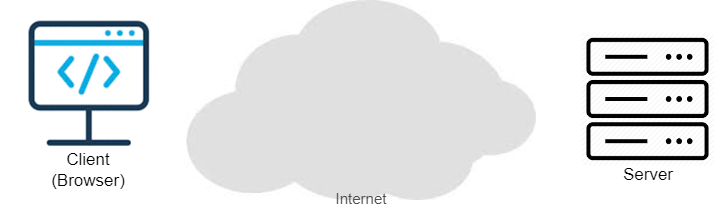
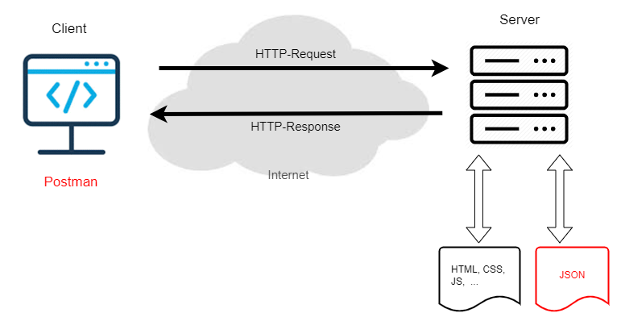
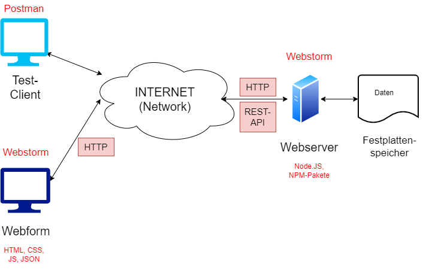
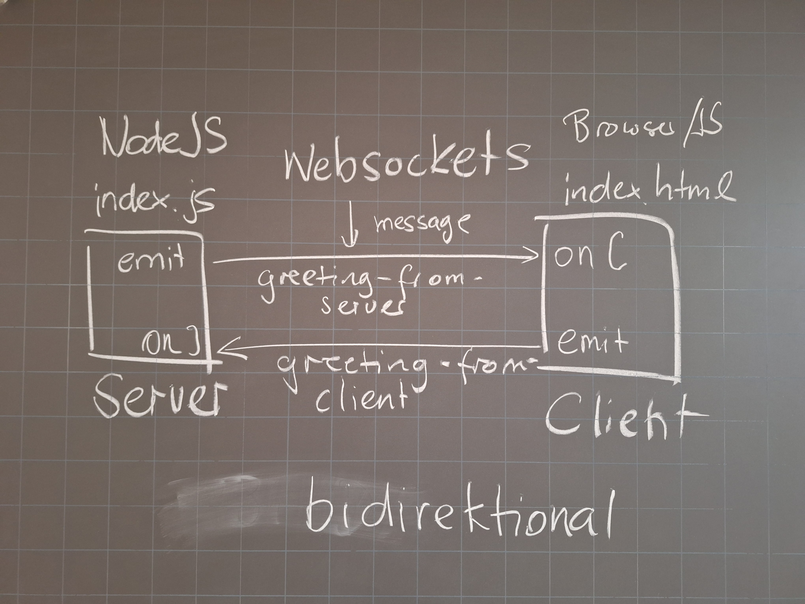

# FFIT-2 - Grundlagen Server-Programmierung

### Code zum Freifach
Die enstprechenden Lernziele finden Sie auf http://ict.bzzlab.ch, anschliessend Ihren Jahrgang wählen.
Ich wünsche Ihnen viel Erfolg bei der Bearbeitung der Praxis-Beispiele.
Daniel Garavaldi

### Kommunikation zwischen Client und Server
Leitfrage: Wie kommunizieren Client (Browser) und Server (Webserver) miteinander? 

Antwort: Über das HTTP-Protokoll (Pull-Modell) bestehend aus Request (Anfrage vom Client) und 
Response (Antwort vom Server):

### Eingesetzte Technologien und Tools

### Websockets
